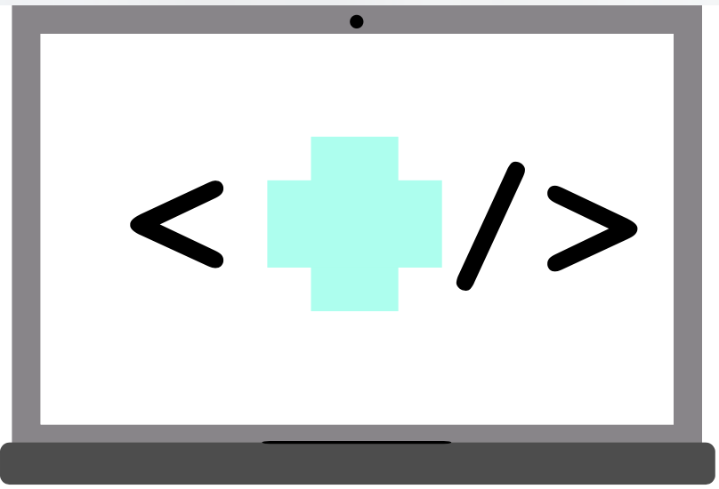

# 1. Introdução

[Ver slides do Workshop](http://www.slideshare.net/AmirdoNascimentoElem/html-e-css-71006416)

#### HTML (HyperText Markup Language)
- Criado em 1993
- Serve para organizar elementos de estruturação de uma página
- Interpretado pelos navegadores de forma nativa
- HTML5 lançado em 2014

#### CSS (Cascate Style Sheets)
- Criado em 1996
- Serve para organizar elementos de estilo da página
- Interpretado pelos navegadores de forma nativa
- CSS3 lançado em 1998 e ainda em desenvolvimento

#### DOM (Document Object Model)
- Ao ser "lido" pelo navegador, o arquivo HTML se transforma num arquivo-objeto
- O arquivo-objeto é parte da janela-objeto
- Tem métodos e propriedades para acesso aos seus objetos

# 2. Estrutura de arquivos/pastas
```
├── index.html
├── static
|   ├── css
|   |── ── bootstrap.min.css
|   |── ── style.css
|   ├── images
|   |── ── (imagens do projeto)
|   └── js
|   |── ── all.js
|   |── ── bootstrap.min.js
├── bower components
    ├── (muitos arquivos)
```
# 3. Estrutura Básica

O HTML é formado por tags, as tags que formam a estrutura básica são ```<html>```, ```<head>```, ```<body>```, ```<title>```,```<script>```, ```<meta>``` e ```<link>```.

A tag ```<html>``` informa ao navegador que se trata de um código HTML.
A tag ```<head>``` é onde são inseridas informações que serão carregadas pelo navegador antes da página em si. Dentro de ```<head>``` é inserida a tag ```<title>```, que determina o título da página, que será exibido na barra de título.
Outras tags que são inseridas dentro de ```<head>``` são:
```<meta>```: determina elementos de configuração, como codificação de letra e idioma da página.
```<link>```: usada para carregar folhas de estilo na página.
```<script>```: usada para carregar scripts na página.
Abaixo de ```<head>``` é inserida a tag ```<body>```. Em ```<body>``` são inseridos os elementos que farão parte do corpo da página e serão exibidos ao usuário.

Abaixo, o código que já carrega algumas bibliotecas JavaScript e CSS, além de fontes. Também são carregados scripts e folhas de estilo que serão criados por nós posteriormente:

**HTML**
```
<!DOCTYPE html>
<head>
  <meta charset="utf-8">
  <meta name="viewport" content="width=device-width, initial-scale=1">
  <link rel="stylesheet" href="https://maxcdn.bootstrapcdn.com/bootstrap/3.3.7/css/bootstrap.min.css">
  <link rel="stylesheet" href="static/css/styles.css">
  <link rel="stylesheet" href="static/css/font-awesome-4.7.0/css/font-awesome.min.css">
  <link href="https://fonts.googleapis.com/css?family=Lato|Share+Tech+Mono" rel="stylesheet">
  <script src="bower_components/webcomponentsjs/webcomponents.js"></script>
  <link href="bower_components/paper-input/paper-input.html" rel="import">
  <link href="bower_components/paper-input/paper-textarea.html" rel="import">
  <script
    src="https://code.jquery.com/jquery-3.1.1.min.js"
    integrity="sha256-hVVnYaiADRTO2PzUGmuLJr8BLUSjGIZsDYGmIJLv2b8="
    crossorigin="anonymous"></script>
  <script src='http://ajax.googleapis.com/ajax/libs/jqueryui/1.8.5/jquery-ui.min.js'></script>
  <script src="static/js/all.js"></script>
</head>

<body>
```
**COLOQUE SEU CÓDIGO HTML AQUI**
```
</body>
</html>
```

É importante lembrar que algumas tags têm que ser "fechadas", como é o caso das tags ```<body>``` e ```<html>```, que são fechadas ao fim do código.

Por padrão, salvaremos o arquivo como ```index.html```

Para evitar problemas causados por cada navegador fazer um tipo de renderização, vamos definir que o HTML e BODY ocupam 100% da tela.
Além disso, usaremos a _rule_ ```@media```, exclusiva do CSS3, para determinar tamanhos diferentes para dispositivos com tamanho de tela diferentes, tornando nosso layout responsivo.

Por fim, definimos uma fonte personalizada para as tags ```<h1>```, ```<h2>```, ```<h3>```, ```<h4>```, ```<h5>```, ```<h6>``` e ```<p>```.

As tags ```<h1>```, ```<h2>```, ```<h3>```, ```<h4>```, ```<h5>``` e ```<h6>``` determinam tamanhos de letra, sendo ```<h1>``` a maior e ```<h6>``` a menor.
a tag ```<p>``` é utilizada para criação de parágrafos.

**CSS**
Nosso código CSS fica assim:
```
body, html{
  height: 100%;
}

/* Large desktops and laptops */
@media (min-width: 1200px) {
  .tecnologias{
  height:100%;
  }
  h1.logo{
    font-size:50px;
  }
  .contactform{
    width:600px;
  }
}

/* Landscape tablets and medium desktops */
@media (min-width: 992px) and (max-width: 1199px) {
  .tecnologias{
    height:100%;
  }
  h1.logo{
    font-size:50px;
  }
  .contactform{
    width:400px;
  }
}

/* Portrait tablets and small desktops */
@media (min-width: 768px) and (max-width: 991px) {
  .contactform{
    width:600px;
  }
}

/* Landscape phones and portrait tablets */
@media (max-width: 767px) {
  .contactform{
    width:500px;
  }
}

/* Portrait phones and smaller */
@media (max-width: 480px) {
  .contactform{
    width:300px;
  }
}

h1,h2,h3,h4,h5,h6,p {
  font-family: 'Lato', sans-serif;
}
```
Por padrão, salvaremos o arquivo com o nome ```style.css```


# 4. Menu
**HTML**
Para a criação do menu, são utilizadas as tags ```<nav>```, ```<div>```, ```<a>```, ```<button>```, ```<ul>``` e ```<li>```.
A tag NAV, exclusiva do HTML5, é usada para criação de elementos de navegação com links, como é o caso do nosso menu.
Dentro dela são inseridas as tags __DIV__, que são divisões feitas na tela, de acordo com as configurações especificadas, são o principal meio de organizar elementos na tela.
Além delas são usadas outras tags:
```<a>```: é usada para a criação de links.
```<button>```: usada para criação de botões.
```<ul>```: usada para criação de listas não ordenadas.
```<li>```: especifica cada item de uma lista.

Abaixo o código do menu:
```
  <nav class="navbar navbar-default navbar-fixed-top transp">
    <div class="container">
      <div class="navbar-header">
        <a class="navbar-brand logo scrollto" href="#head">Seu Nome</a>
        <button class="navbar-toggle transp" data-toggle="collapse" data-target=".headerclpse">
        </button>
      </div>
      <div class="collapse navbar-collapse headerclpse">
        <ul class="nav navbar-nav navbar-right">
          <li class="center"><a class="scrollto" href="#servicos">Serviços</a></li>
          <li class="center"><a class="scrollto" href="#portfolio">Portfolio</a></li>
          <li class="center"><a class="scrollto" href="#tecnologias">Tecnologias</a></li>
          <li class="center"><a class="scrollto" href="#contact">Contato</a></li>
        </ul>
      </div>
    </div>
  </nav>
```
**CSS**
Note que algumas tags possuem o atributo _class_, que indica uma classe. 
As classes são "apelidos" dados a um conjunto com um ou mais comandos. Ao atribuir uma classe a um elemento HTML, atribuímos esses comandos àquele elemento, dando a ele determinadas características.
As classes podem ser definidas _inline_, dentro da tag HTML ou em um arquivo CSS. Por questões de boas práticas e facilidade de manutenção, colocaremos no arquivo CSS.

```
.logo {
  font-family: 'Share Tech Mono', monospace;
}

.transp {
  background-color: white !important;
  background: transparent;
  border-color: transparent !important;
}

.activeheader:hover{
  color:black;
}

.sects{
  height:100%
}

.center{
  text-align: center;
}

.vcenter{
  display: flex;
  justify-content: center;
  align-items: center;
}
```

# 5. Banner
**HTML**
Para criação do banner, usaremos as tag ```<header>```, `````` e ```<div>```.
A tag ```<header>```, exclusiva do HTML5, indica a seção introdutória da página, normamente um banner ou slideshow. Para mostrar o banner, usamos a tag ``````, que carrega uma imagem do arquivo ou de um site, de acordo com o endereço especificado.
```
  <!-- BANNER -->
  <header id="head" class="head sects vcenter">
    <div class="container">
      <div class="row">
        <div class="col-lg-12 center">
          
        </div>
      </div>
    </div>
  </header>
```

# 6. Serviços

**HTML**
Na seção Serviços, usaremos a tag ```<section>```, exclusiva do HTML5, que é utilizada para separar uma seção da página.
Dentro da seção há um _container_, que dá um espaçamento ao conjunto de elementos, contendo duas linhas. 
A primeira linha é usada para o título, a segunda linha possui três colunas, cada uma possuindo um título e um texto.
```
<!-- SERVIÇOS -->
  <section id="servicos" class="sects objective vcenter">
    <div class="container">
      <div class="row">
        <div class="col-lg-12 center">
          <h2> Serviços </h2>
        </div>
      </div>
      <div class="row">
        <div class="col-lg-4 center">
          <h3> Análise de Dados </h3>
          <h4> <!-- TEXTO AQUI -->
              Lorem ipsum dolor sit amet, consectetur adipiscing elit. Aenean sit amet ipsum vitae ex volutpat eleifend sit amet a lectus. Phasellus eleifend aliquet eros eget maximus. 
          </h4>
        </div>
        <div class="col-lg-4 center">
          <h3> Desenvolvimento Web </h3>
          <h4> <!-- TEXTO AQUI -->
            Maecenas volutpat elit nec odio ultricies, et dignissim risus cursus. Class aptent taciti sociosqu ad litora torquent per conubia nostra, per inceptos himenaeos. 
          </h4>
        </div>
        <div class="col-lg-4 center">
          <h3> Internet of Things </h3>
          <h4> <!-- TEXTO AQUI -->
            Cras suscipit tortor eu ligula sollicitudin, sit amet commodo velit rutrum. Ut vel massa non orci vulputate cursus sed eget metus. Phasellus eu velit tempus, auctor enim id, ultrices nulla. 
          </h4>
        </div>
      </div>
    </div>
  </section>
```
**CSS**
A única classe personalizada usada aqui é a _objective_, que define uma cor de fundo diferente para esta seção.
```
.objective{
  background-color:#F4fDFF;
}
```

# 7. Portfólio
**HTML**
A seção Portfólio é bem parecida com a seção serviços, porém a segunda linha tem apenas duas colunas e cada coluna tem uma imagem e um link.
```
<!-- PORTFOLIO -->
  <section id="portfolio" class="sects idea vcenter">
    <div class="container">
      <div class="row">
        <div class="col-lg-12 center">
          <h2> Portfolio </h2>
          <h4>
              <br />
          </h4>
        </div>
      </div>
      <div class="row">
          <div class="col-lg-6 center">
              <a href="www.devnhealth.com.br" target="_blank">
              

              <br />
              <h4>
                Dev'n Health
              </h4>
              </a>
          </div>
          <div class="col-lg-6 center">
              <a href="www.magnolia-jewellery.com.au" target="_blank">
              
              <br />
              <h4>
                Magnolia Silver Jewellery
              </h4>
              </a>
          </div>
      </div>
    </div>
  </section>
```
**CSS**
Nesta seção, teremos uma cor diferente da seção anterior.
```
.portfolio{
  background-color: #FFFFFF;
}
```

# 8. Tecnologias
**HTML**
Nesta seção, definiremos uma linha centralizada que possui cinco imagens com formato retangular. Através do CSS, tornaremos essas imagens em círculos.
```
<!-- TECNOLOGIAS -->
  <section id="tecnologias" class="objective vcenter">
    <div class="container" style='padding-top:50px;'>
      <div class="row center">
        <div class="col-lg-12 center">
          <h2> Tecnologias </h2>
        </div>
        <div class="col-lg-4 col-md-4 col-xs-12 card">
          <div class="crop">
            <div class="round jquery"></div>
          </div>
            jQuery
        </div>
        <div class="col-lg-4 col-md-4 col-xs-12 card">
          <div class="crop">
            <div class="round django"></div>
          </div>
            Django
        </div>
        <div class="col-lg-4 col-md-4 col-xs-12 card">
          <div class="crop">
            <div class="round python3"></div>
          </div>
          Python 3
        </div>
        <div class="col-lg-4 col-lg-offset-2 col-md-4 col-md-offset-2 col-xs-12 card">
          <div class="crop">
            <div class="round html5"></div>
          </div>
            HTML5
        </div>
        <div class="col-lg-4 col-md-4  col-xs-12 card">
          <div class="crop">
            <div class="round css3"></div>
          </div>
          CSS3
        </div>
      </div>
    </div>
  </section>
```

**CSS**
O CSS será usado para ajustar a posição dos objetos e fazer o "recorte" da imagem em um círculo.
```
.card{
  padding:20px;
}

.crop{
  margin: 0 auto;
  max-width: 150px;
  height: auto;
  position: relative;
  overflow: hidden;
}

.round{
  display: block;
  margin: 0 auto;
  height: 150px;
  width: 150px;
  -webkit-border-radius: 50%;
  -moz-border-radius: 50%;
  -ms-border-radius: 50%;
  -o-border-radius: 50%;
  border-radius: 50%;
}

.python3{
  background:url("../images/python.png") center no-repeat;
  background-size: cover;
}

.django{
  background:url("../images/django.png") center no-repeat;
  background-size: cover;
}

.jquery{
  background:url("../images/jquery.png") center no-repeat;
  background-size: cover;
}

.html5{
  background:url("../images/html5.png") center no-repeat;
  background-size: cover;
}

.css3{
  background:url("../images/css3.png") center no-repeat;
  background-size: cover;
}
```

# 9. Contato
**HTML**
Através da biblioteca WebComponents, é possível criar um formulário de contato com design inovador e validação automática.
```
<!-- CONTATO -->
  <section id="contact" class="sects contact vcenter">
    <div class="container">
      <div class="row">
        <div class="col-lg-12 center">
          <h2> Contato </h2>
          <form class="contactform" >
          <style is="custom-style">
            :root {
              --iron-autogrow-textarea: {
                font-family: 'Share Tech Mono', monospace !important;
              };
              --paper-input-container-focus-color: #6fcecb;
              --paper-input-container-input: {
                font-family: 'Share Tech Mono', monospace !important;
              }
            }
          </style>
            <paper-input id="formname" required auto-validate error-message="Por favor, insira seu nome" label="Nome"></paper-input>
            <paper-input id="formemail" required auto-validate error-message="Por favor, insira seu email" label="Email"></paper-input>
            <paper-textarea id="formmsg" auto-validate label="Mensagem"></paper-textarea>
            <button class="contactsubmit"><b>Enviar!</b></button>
          </form>
        </div>
      </div>
    </div>
  </section>
```
**CSS**
O CSS será utilizado para posicionamento do formulário.
```
.linksource{
  text-decoration: none;
  color: black;
}

.fa{
  font-size: 1.5em !important;
}

.contact{
  overflow: scroll;
}

.contactform{
  text-align:left;
  margin:0 auto;
}

.contactsubmit{
  width: 45%;
  font-family: 'Share Tech Mono', monospace;
  display: block;
  margin: 0 auto;
  margin-top: 15px;
  padding: 10px 10px 10px 10px;
  background-color: #EAEAEA;
  border: none;
  transition: all 0.5s ease;
}

.contactsubmit:hover{
  background-color: #969696;
  color: white;
}
```

### EXTRA

# 10. Slideshow

Se, ao invês de colocar uma imagem como banner, você quiser ter um slideshow, é possível, através dos seguintes trechos de código:
**HTML**
Substitua a seção Banner, apagando tudo entre as tags ```<header>```, inclusive as tags ```<header>```. No lugar, coloque o código abaixo:
```
<div class="slideshow-container">
  <div class="mySlides fade">
    <div class="numbertext">1 / 3</div>
    
    <div class="text">Caption Text</div>
  </div>

  <div class="mySlides fade">
    <div class="numbertext">2 / 3</div>
    
    <div class="text">Caption Two</div>
  </div>

  <div class="mySlides fade">
    <div class="numbertext">3 / 3</div>
    
    <div class="text">Caption Three</div>
  </div>

  <a class="prev" onclick="plusSlides(-1)">&#10094;</a>
  <a class="next" onclick="plusSlides(1)">&#10095;</a>
</div>
<br>

<div style="text-align:center">
  <span class="dot" onclick="currentSlide(1)"></span> 
  <span class="dot" onclick="currentSlide(2)"></span> 
  <span class="dot" onclick="currentSlide(3)"></span> 
</div>
```
**CSS**
Adicione o códgio ao arquivo ```style.css```. Copie o código e cole no final do arquivo:
```
/* Slideshow container */
.slideshow-container {
  max-width: 1000px;
  position: relative;
  margin: auto;
  padding-top: 40px;
}

/* Next & previous buttons */
.prev, .next {
  cursor: pointer;
  position: absolute;
  top: 50%;
  width: auto;
  margin-top: -22px;
  padding: 16px;
  color: white;
  font-weight: bold;
  font-size: 18px;
  transition: 0.6s ease;
  border-radius: 0 3px 3px 0;
}

/* Position the "next button" to the right */
.next {
  right: 0;
  border-radius: 3px 0 0 3px;
}

/* On hover, add a black background color with a little bit see-through */
.prev:hover, .next:hover {
  background-color: rgba(0,0,0,0.8);
}

/* Caption text */
.text {
  color: #f2f2f2;
  font-size: 15px;
  padding: 8px 12px;
  position: absolute;
  bottom: 8px;
  width: 100%;
  text-align: center;
}

/* Number text (1/3 etc) */
.numbertext {
  color: #f2f2f2;
  font-size: 12px;
  padding: 8px 12px;
  position: absolute;
  top: 0;
}

/* The dots/bullets/indicators */
.dot {
  cursor:pointer;
  height: 13px;
  width: 13px;
  margin: 0 2px;
  background-color: #bbb;
  border-radius: 50%;
  display: inline-block;
  transition: background-color 0.6s ease;
}

.active, .dot:hover {
  background-color: #717171;
}

/* Fading animation */
.fade {
  -webkit-animation-name: fade;
  -webkit-animation-duration: 1.5s;
  animation-name: fade;
  animation-duration: 1.5s;
}

@-webkit-keyframes fade {
  from {opacity: .4} 
  to {opacity: 1}
}

@keyframes fade {
  from {opacity: .4} 
  to {opacity: 1}
}
```
**Javascript**
Coloque esse trecho no arquivo ```all.js```, na pasta ```static/js```.
Copie o seguinte trecho e cole ao final do arquivo:
```
var slideIndex = 1;
showSlides(slideIndex);

function plusSlides(n) {
  showSlides(slideIndex += n);
}

function currentSlide(n) {
  showSlides(slideIndex = n);
}

function showSlides(n) {
  var i;
  var slides = document.getElementsByClassName("mySlides");
  var dots = document.getElementsByClassName("dot");
  if (n > slides.length) {slideIndex = 1} 
  if (n < 1) {slideIndex = slides.length}
  for (i = 0; i < slides.length; i++) {
      slides[i].style.display = "none"; 
  }
  for (i = 0; i < dots.length; i++) {
      dots[i].className = dots[i].className.replace(" active", "");
  }
  slides[slideIndex-1].style.display = "block"; 
  dots[slideIndex-1].className += " active";
}

//Automatico
var slideIndex = 0;
showSlides();

function showSlides() {
    var i;
    var slides = document.getElementsByClassName("mySlides");
    var dots = document.getElementsByClassName("dot");
    for (i = 0; i < slides.length; i++) {
       slides[i].style.display = "none";  
    }
    slideIndex++;
    if (slideIndex> slides.length) {slideIndex = 1}    
    for (i = 0; i < dots.length; i++) {
        dots[i].className = dots[i].className.replace(" active", "");
    }
    slides[slideIndex-1].style.display = "block";  
    dots[slideIndex-1].className += " active";
    setTimeout(showSlides, 2000); // Muda imagem a cada 2 segundos
}

```

Este é o fim do nosso tutorial. Espero que você tenha gostado!

[Ver slides do Workshop](http://www.slideshare.net/AmirdoNascimentoElem/html-e-css-71006416)
